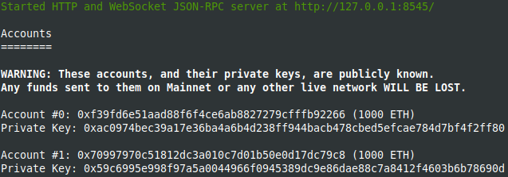
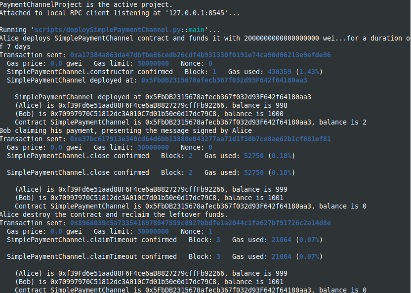
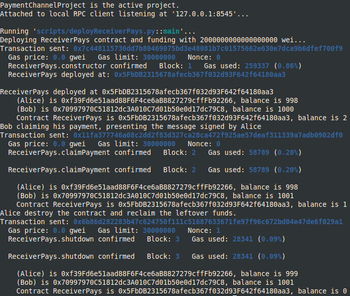
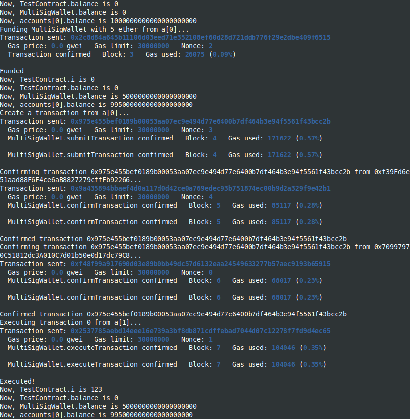
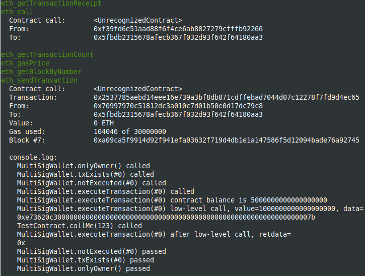
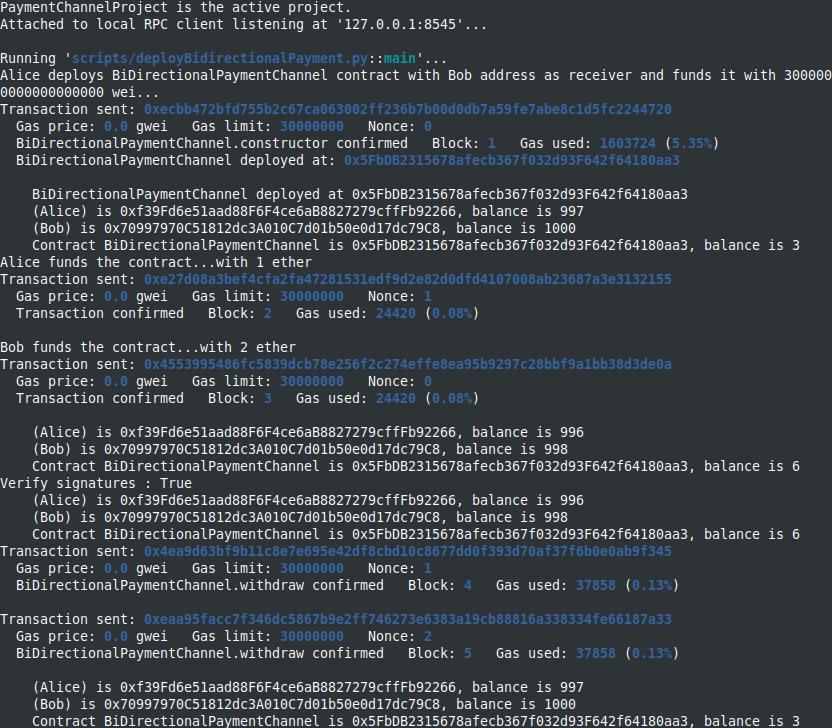
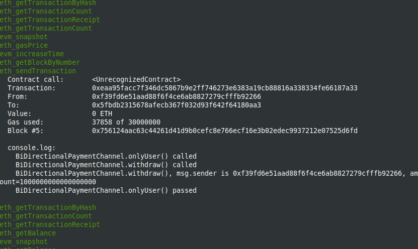
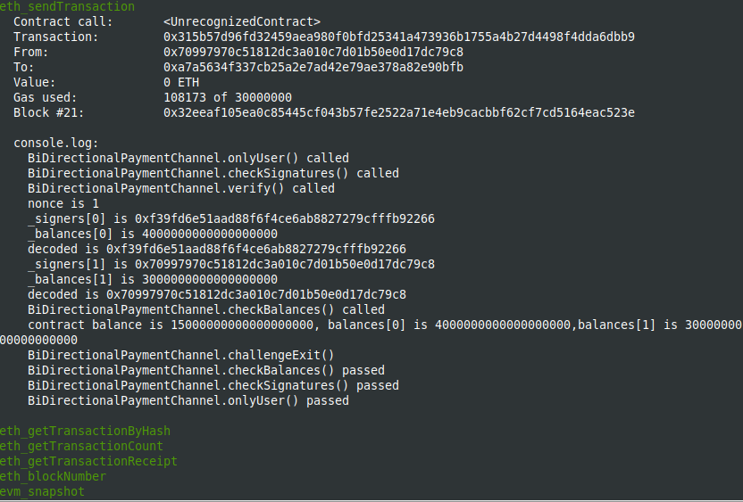
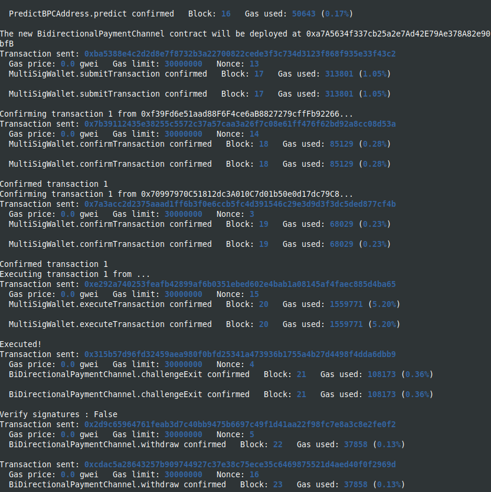

Study case of Payment Channels, from [Solidity Documentation, Micropayment Channel]
(https://docs.soliditylang.org/en/latest/solidity-by-example.html#micropayment-channel)
and Solidity by example site [Solidity by Example, bidirectional](https://solidity-by-example.org/app/bi-directional-payment-channel/)

I use brownie to compile and deploy into hardhat in order to have the console.log feature.
You should start the hardhat node in another terminal and folder (`hh node`):
Here are the hardhat accounts and private keys I used in my hardhat dev environment:
Starting hardhat:

Also, the file .env.example contain these settings as well, it should be renammed as .env in order to launch the deploy scripts.

There are several contracts in the contracts folder:

SimplePaymentChannel.sol and the corresponding deploySimplePaymentChannel.py in scripts folder, demonstrates the creation of a Simple Payment Channel,
deployment and execution, encoding the messages off-chain (meta-transactions) using web3.solidityKeccak, signing the messages and claiming payments using
 these signatures.
Deployment from brownie:

UnidirectionalPayment.sol and the corresponding scripts/deployUniDirectionalPaymentChannel.py in scripts folder, is similar with SimplePaymentChannel.
Deployment from brownie:

ReceiverPays.sol and and the corresponding scripts/deployReceiverPays.py in scripts folder, same logique of simple payment channels.
Deployment from brownie:

Multisig_wallet.sol and the corresponding scripts/deployMultisigWallet.py in scripts folder, deploys a multi-signature wallet and execute transactions
on the TestContract.

From brownie console:

The result in the hardhat console:

BidirectionalPayment.sol and the corresponding scripts/deployBidirectionalPayment.py in scripts folder, demonstrates the deployment of a Bi-directional
 Payment Channel, signing messages off-chain, and executing transactions with signatures while verifying these signatures in the blockchain.

Deployment from brownie:

The result in the hardhat console:

PredictBPCAddress.sol is a helper contract, used for predicting the address of a new created Bi-directional channel (with the new syntax for create2),
encode the call data for the deploy function and the deploy function, which will create the channel.
This contract is used in the scripts/deploy.py, together with MultisigWallet and BidirectionalPayment.

The script scripts/deploy.py is a starting implementation of the requirements described in the comments from
Solidity by example site [Solidity by Example, bidirectional](https://solidity-by-example.org/app/bi-directional-payment-channel/)

The script is still in his begining phase, not refactored, not very cleaned-up, but it demonstrates how to deploy a MultisigWallet, 
create transactions that will deploy a BidirectionalPaymentChannel, executes it, sign and exchanges signatures off-chain and 
generally executing all operations on these contracts.

The deploy.py log in the hardhat console is very big, I included a text log where I cleaned out unnecessary informations:

A screenshot from the hardhat console:

And from brownie:

